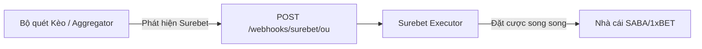

# Hướng dẫn thông báo Surebet qua Webhook

Tài liệu này mô tả cách hệ thống quét kèo (Scanner/Aggregator) thông báo cho bộ thực thi (Executor) khi phát hiện một cơ hội Surebet.

## 1. Luồng hoạt động (Workflow)



1. **Scanner/Aggregator**: Liên tục theo dõi tỷ lệ kèo từ các nhà cái. Khi phát hiện chênh lệch tỷ lệ tạo ra Surebet (Profit > 0), nó sẽ đóng gói thông tin vào một payload JSON.
2. **Webhook**: Scanner gửi một yêu cầu `HTTP POST` tới Executor.
3. **Executor**: Nhận thông tin, thẩm định rủi ro (Risk Check), đảm bảo không trùng lặp (Deduplication) và thực hiện đặt lệnh tự động bằng Playwright.

## 2. Thông tin Endpoint

- **Method**: `POST`
- **URL**: `http://<executor-host>:3000/webhooks/surebet/ou`
- **Content-Type**: `application/json`

## 3. Cấu trúc Payload (Dữ liệu gửi đi)

Dưới đây là ví dụ về payload mà Scanner cần gửi cho Executor:

```json
{
  "opportunity_id": "unique_id_12345",
  "sport": "football",
  "market": "OU",
  "scope": "FT",
  "home": "Song Lam Nghe An",
  "away": "SHB Da Nang",
  "from_books": "saba+x1",
  "line": 3,
  "profit_pct": 1.54,
  "updated_at": "2026-04-13T12:00:00Z",
  "bet": {
    "total_stake": 200,
    "profit_pct_calc": 1.54,
    "payout_equal": 203.08,
    "legs": [
      {
        "book": "saba",
        "type": "Over",
        "odds": 2.09,
        "stake": 97.17,
        "label": "Over 3 @saba"
      },
      {
        "book": "x1",
        "type": "Under",
        "odds": 1.975,
        "stake": 102.83,
        "label": "Under 3 @x1"
      }
    ]
  }
}
```

### Giải thích các trường quan trọng:

- **`opportunity_id`**: Mã định danh duy nhất cho cơ hội này. Executor dùng mã này để chống trùng lặp (deduplication).
- **`from_books`**: Các nhà cái tham gia (ví dụ: `saba+x1`).
- **`bet.legs`**: Mảng chứa thông tin từng "chân" của Surebet.
    - **`book`**: Mã nhà cái (`saba`, `x1`, `b188`, ...).
    - **`type`**: Loại kèo (`Over`, `Under`, `1`, `2`, ...).
    - **`odds`**: Tỷ lệ cược tại thời điểm phát hiện.
    - **`stake`**: Số tiền cần đặt cho chân này (đã được Scanner tính toán cân bằng).

## 4. Ai là người thông báo?

Trong hệ thống **u-best**, phía thông báo thường là:
1. **Odds Aggregator (Python service)**: Sau khi gộp kèo và phát hiện Surebet, service này sẽ trực tiếp gọi Webhook này.
2. **n8n / Automation Workflow**: Một luồng tự động hóa nhận dữ liệu từ Aggregator, tính toán lợi nhuận và chuyển tiếp lệnh tới Executor.

## 5. Lưu ý về Thời gian thực (Real-time)

Để đảm bảo tỷ lệ cược không bị thay đổi (stale odds), Scanner nên gửi thông báo **ngay lập tức** khi phát hiện. Executor có cấu hình `STALE_WINDOW_MS` (mặc định 5s) để từ chối các kèo đã quá cũ.
